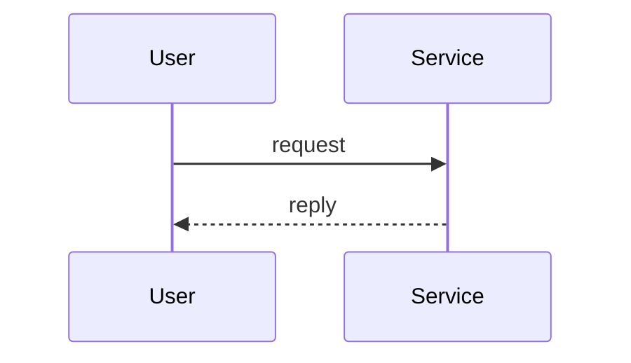

# Fixture plan

- **Point one.** A bullet with a number 42 and a ref `file.py:10`.

| Node | Wave |
|---|---|
| N1 | 1 |

```mermaid
flowchart LR
  A[Repo] --> B[Service]
```

```mermaid
sequenceDiagram
  participant U as User
  participant S as Service
  U->>S: request
  S-->>U: reply
```
